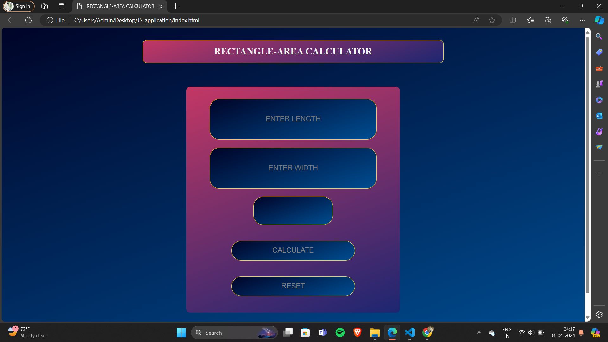

# Reactanle-Area Calculator

**WELCOME TO REACTANGLE-AREA CALCULATOR DESIGN:**
This is a `open-source` project serves as an example for YouTube design inspired from the Area Calculator` Reactanle-Area Calculator
` design and utilised the knowledge provided by `road to code's
course`.

whether you are an employee or a normal person calculator serves as an important aspect of any calculations as it serves itself for `valid calculations` of any `information`.This Calculator can help you to have a basic idea about how a calculator is designed and how it  works.This calculator is based on the design to calculate area of rectangle.

## How to contribute 

We welcome contributions from the community to help us improve this project.IF you would like to contribute,follow these steps:

1.Fork the repository to your Github account 

2.Make your changes, add new content,or fix any existing issues.

3.Open a new pull request in this repository.

